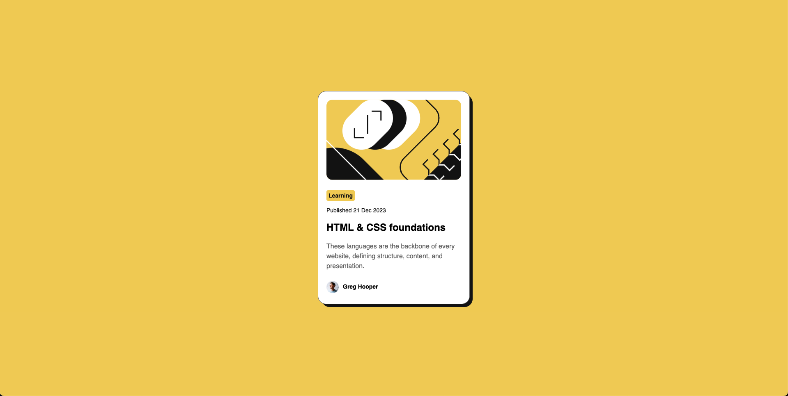

# Frontend Mentor - Blog preview card solution

This is a solution to the [Blog preview card challenge on Frontend Mentor](https://www.frontendmentor.io/challenges/blog-preview-card-ckPaj01IcS). 

## Table of contents

- [Overview](#overview)
- [Screenshot](#screenshot)
- [Built with](#built-with)
 

## Overview
Good challengde to practice positioning and adding a background to an element.

### Screenshot

### Built with

- Semantic HTML5 markup
- CSS custom properties
- Flexbox